# 映射适应的特征提取方法

## 目标

这里的映射适应特征指的是提取两幅图像之间的匹配特征，在不同角度，不同位置的摄像机下拍摄的图像，它们之间存在着很复杂的映射，此算法可以在这种复杂关系下提取尽可能多的匹配特征。

## 思路

核心在于使用 Moving DLT 算法扭曲图像。

同一场景的两幅不同图像，在使用 ASIFT 等算法提取特征后，满足仿射不变的情况，或者说提取仿射不变性特征。

现在可以考虑将一副图像通过提取的仿射不变特征尽可能地变换为另一幅图像（Moving DLT），然后在使用 ASIFT 算法提取特征，这样重复到稳定，便获取映射适应的特征（尽可能透视），也就是 APAP 文章中的思路。

## 日志记录

### 2021-02-08 粗略的 Moving DLT

大致实现了 Moving DLT 算法，但在最后的图像扭曲（逆映射）步骤中，因为将原图划分为多个块，所以单应矩阵 H 变换不是连续的，变换后的块之间会有间隙（黑块）如图：

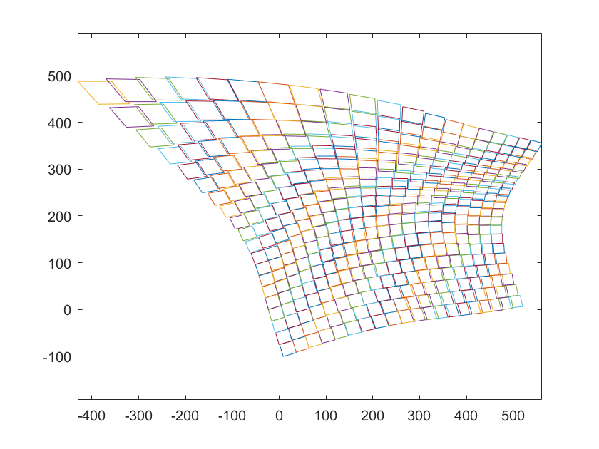

其对应生成的图片为：

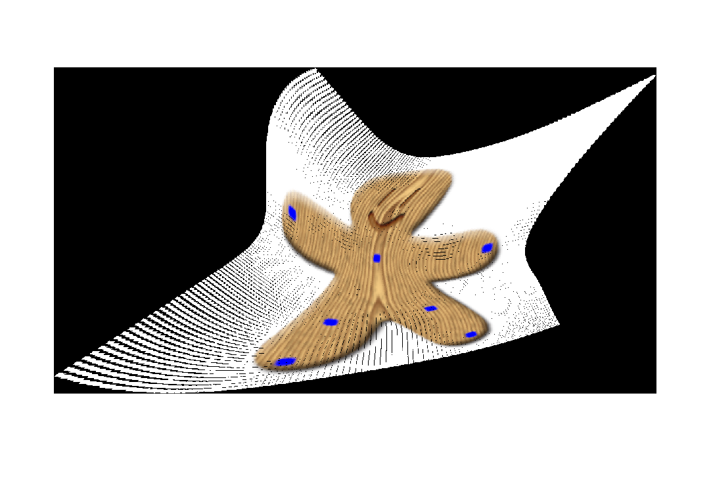

黑边就是 H 变换不连续变化导致的，现在考虑对 **每一个变换后的子块都取其左上角的点构建新的连续的映射网格**，但就会存在一个新的问题：**原来的单应变换 H 将和新生成的映射网格有轻微的不同**（当网格很小时，区别便更小了），考虑是否需要重新计算单应映射 H。

问题列表：

- [x] 单应变换后网格的不连续

### 2021-02-10 消除网格的不连续

对上面的网格强制连续化，当网格块很多时，差不多都是近似连续的，每个块之间只有很小的间隙，外面可以直接将他们拼接起来，比如都取左上角拼接为新的网格图（边界单独讨论），结果如下：

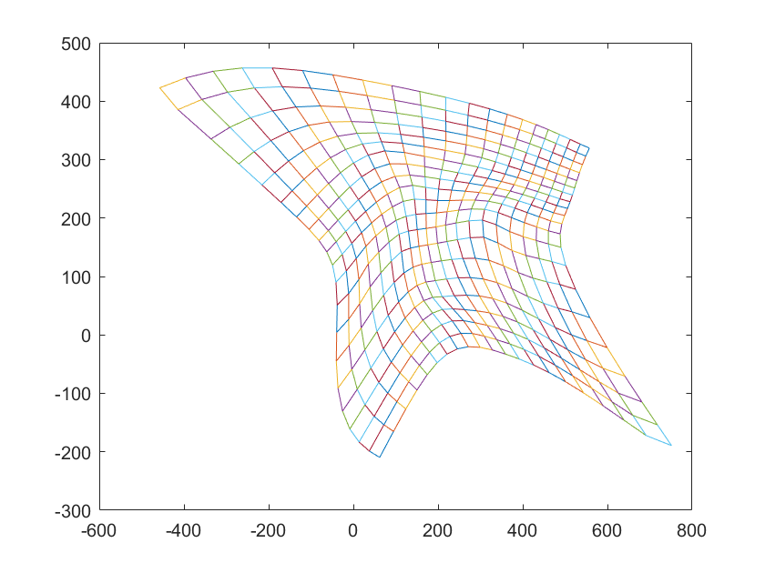

这样之后重新计算单应映射，四个非共线点就可以生成唯一的单应映射，然后重新渲染图像，可得：

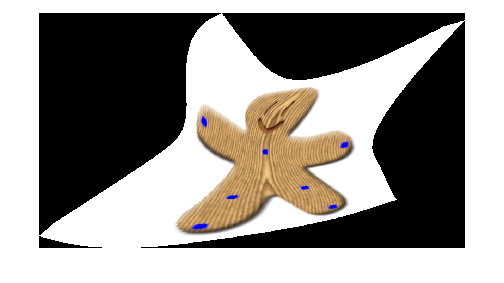

这两幅图是使用的自己选择的匹配点，对图像进行变换。现在结合 ASIFT 对实际的透视变换很大的图执行算法。

原图案如下：

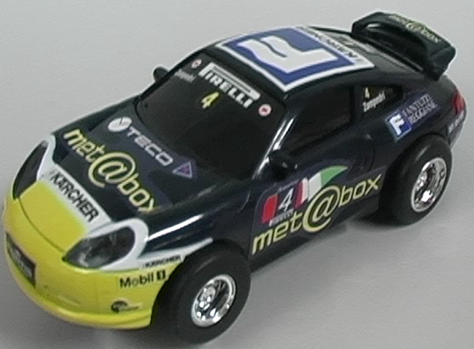

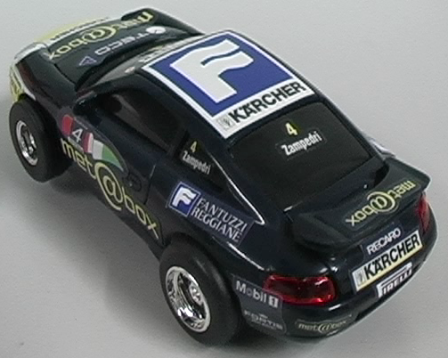

对它们执行 ASIFT，得到的匹配点进行 Moving DLt，变换结果如下：

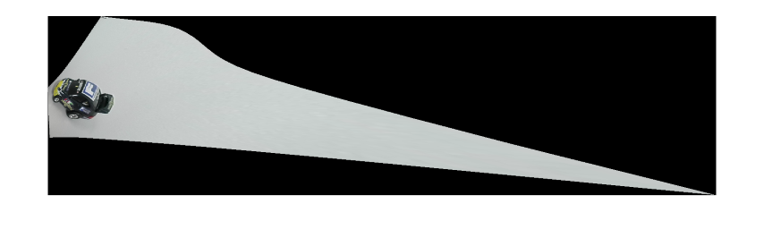

大致上是变换成功了，但是图像变换的十分扭曲，主体的车占比很小，对变换后的图像执行 ASIFT 得到的匹配点数据似乎变少了，但是对变换后的图像只截取车的一部分，匹配点变多了，所以变换后图像的比例过于扭曲则不利于特征点的寻找。

还有一个问题，运行时间，时间主要消耗在构造变换后的新图上，对新图的每一个点，需要判断它属于的块，然后执行对应的单应逆变换。现在判断所属块用的线性遍历，在块数量大时的开销特别大，甚至达到数小时的时间。现在考虑使用**四叉树**来优化时间。

根据新图中块的密度构建四叉树，将原图分为四个区域，然后将块分到四个区域中，递归的构建，知道此区域中块的数量低于某个阈值，可以使用 matlab 的 `intersect` 函数判断是否在某个区域中（只要有交集就认为在）

对比透视变换过大的图，参数选择不恰当可能会导致变换很乱，对于这种情况，`sigma_para` 控制了权值尺度， `lambda_para` 控制了远离当前点的占比，图像只有一部分存在着很大的透视变换，所以远处的点的阈值需要小一点。这个车例子的参数为：

`
sigma_para = 18;
lambda_para = 0.00001;
`

问题列表（Todo）：

- [ ] 使用四叉树加速所属块的判断
- [ ] 考虑是否强制缩小变换后的图（长宽不大于1000）
- [ ] 变换后集中的匹配点占比过少导致的匹配点过少

### 2021-02-15

四叉树优化方案失败。。。

感觉是 matlab 函数调用的开销远大于循环，50*50 的网格切分在以前的线性遍历中，也只有 2500 次，可能是数据还是不够大的原因，这样构造的四叉树调用开销和线性遍历差不多甚至可能不如。所以放弃四叉树来判断所属块的想法，改为优化遍历的策略，可以采用**最近访问优先策略**，因为邻近的像素在一个块中的概率是很大的。然后加入 matlab 的 parfor（并行遍历）优化速度。

### 2021-02-18

之前的最近访问策略并没有提升，改为前向映射后，速度提升，但是缩放会存在空洞。现在在生成每一个子块变换后四边形时，就设置新图中每一个像素对应的单应变换索引，使用空间换时间，现在速度提升很大，用 matlab 都可以压缩到半分钟以内的速度。


> [nyu-seg/demo_ASIFT.exe at master · nazikus/nyu-seg (github.com)](https://github.com/nazikus/nyu-seg/blob/master/ASIFT/demo_ASIFT.exe)

### 2021-04-05

> 局部单应与映射适应卷积结合的实验效果

#### 测试原图

##### 点图

200*200 大小的 3 \* 3点图

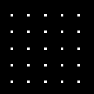

##### 纹理图

同样是 200*200 大小的图

生成代码：

```matlab
imgsize = [200 200];
f1 = 0.02;
f2 = 0.45;
[X, Y] = meshgrid(1:imgsize(2), 1:imgsize(1));
Z = cos(2*pi*f1*X) .* cos(2*pi*f1*Y) + 2*cos(2*pi*f2*X).*cos(2*pi*f2*Y);
normalZ = normalize(Z(:), 'range');
Z = reshape(normalZ, imgsize);
```

这里为 0.02 与 0.45 两个频率结合

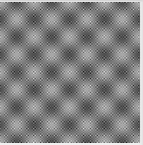

#### 测试思路

1. 手动确定测试图到扭曲图的匹配点映射
2. 通过局部单应生成扭曲图
3. 将扭曲图作为原图，逆向生成最初的测试原图
4. 一个为映射适应卷积处理，一个为标准高斯抗混叠后然后逆映射，一个为直接逆映射
5. 点图观察映射适应性，纹理图查看抗混叠效果

#### 扭曲测试原图

##### 点图扭曲

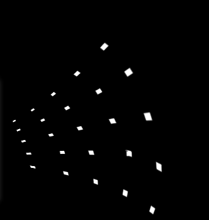

##### 纹理图扭曲

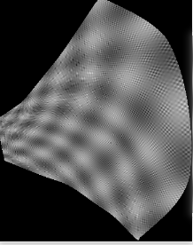

#### 实验结果

实验结果图从左到右依次是：

最初原图、局部单应扭曲图、原图高斯处理、映射适应卷积处理、扭曲图高斯处理后直接逆映射、扭曲图直接逆映射

##### 点图

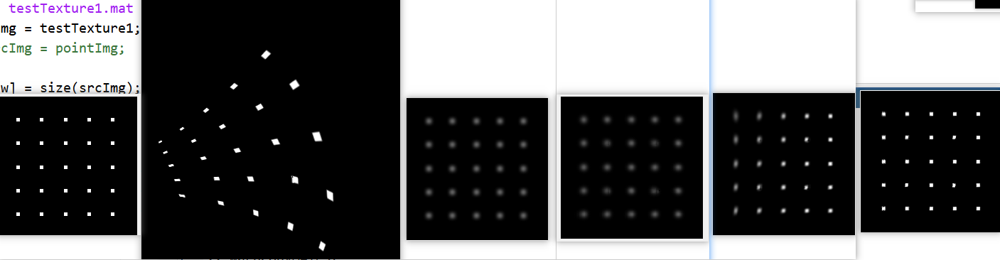

##### 纹理图

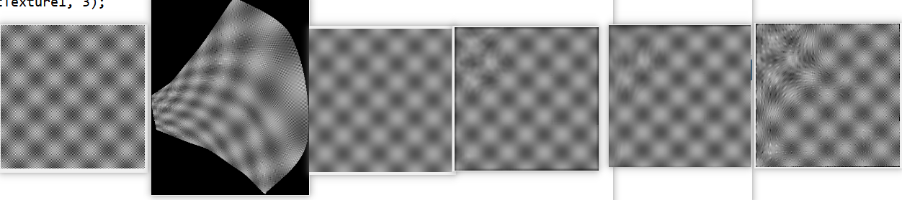

#### 结论

1. 点图实验结果中，映射适应卷积处理后和最初原图直接高斯处理几乎一致，而先高斯处理后直接映射出现了拉伸，即**标准高斯没有映射适应性，映射适应卷积具有与映射适应性**
2. 纹理图实验结果中，扭曲图出现了摩尔纹（混叠）。可以看出，使用高斯抗混叠处理后逆映射（右数第二张）和映射适应卷积和不做抗混叠处理直接映射（右数第一张）相比，起到了不错的抗混叠效果
3. 总的来说，在局部单应生成的扭曲图中，映射适应卷积具备比较好的抗混叠以及映射适应性

#### 后续实验

最终目标为将映射适应卷积结合到特征匹配提取中

思路为：

1. 将现实拍摄图使用局部单应扭曲
2. 然后使用ASIFT提取特征
3. 对扭曲图做映射适应卷积，直接逆映射，高斯抗混叠后直接映射做对比
4. 分别使用ASIFT提取特征
5. 查看匹配点的个数比较优劣

#### 导师建议

1. 点状图的实验中，映射适应卷积的效果不是特别好（虽然大致体现了映射适应性），这可能是由映射不是全局同胚造成的。
2. 纹理实验中，生成的扭曲纹理中已产生了严重的混叠，那么再映射为标准纹理时，产生的已是两次混叠的叠加了，最初扭曲图像时应提高采样率（分辩率）。此外，就理论而言，映射适应卷积的抗混叠性能也是优于标准卷积的。
3. 后续实验的设计似乎存在一点问题，后面再交流一下。

点图的映射适应在全局单应下的表现：

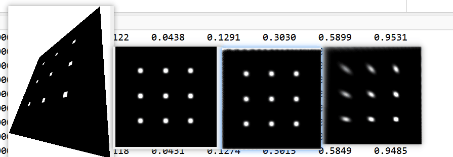

纹理分辨率的加强：

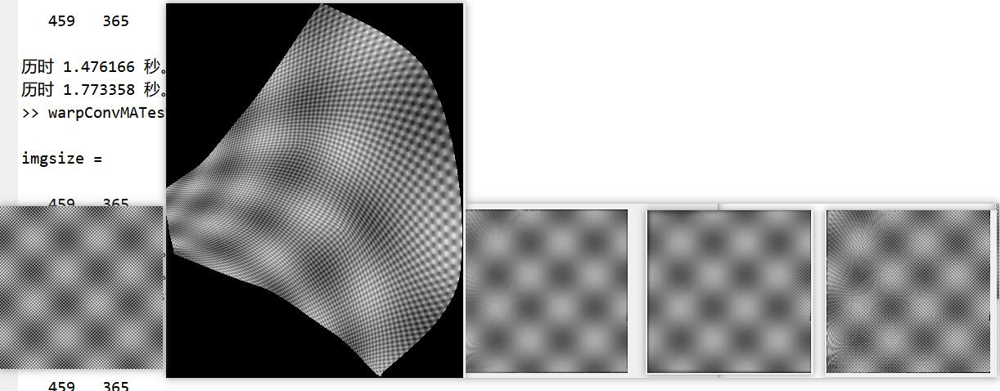

右三图像右侧可体现抗混叠优势