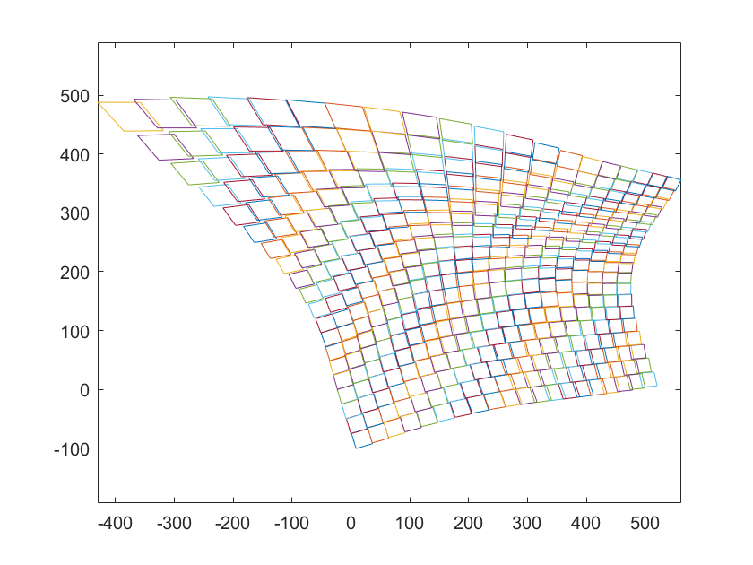
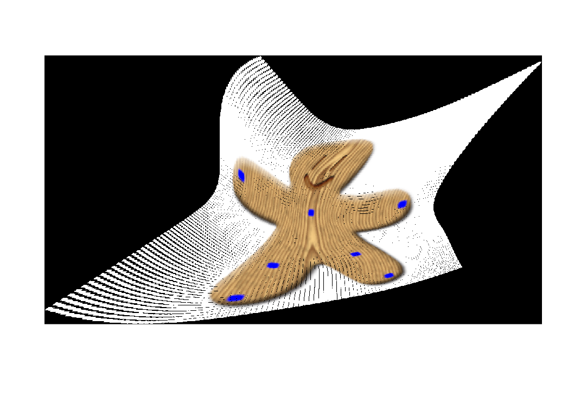

# 映射适应的特征提取方法

## 目标

这里的映射适应特征指的是提取两幅图像之间的匹配特征，在不同角度，不同位置的摄像机下拍摄的图像，它们之间存在着很复杂的映射，此算法可以在这种复杂关系下提取尽可能多的匹配特征。

## 思路

核心在于使用 Moving DLT 算法扭曲图像。

同一场景的两幅不同图像，在使用 ASIFT 等算法提取特征后，满足仿射不变的情况，或者说提取仿射不变性特征。

现在可以考虑将一副图像通过提取的仿射不变特征尽可能地变换为另一幅图像（Moving DLT），然后在使用 ASIFT 算法提取特征，这样重复到稳定，便获取映射适应的特征（尽可能透视），也就是 APAP 文章中的思路。

## 日志记录

### 2021-02-08

大致实现了 Moving DLT 算法，但在最后的图像扭曲（逆映射）步骤中，因为将原图划分为多个块，所以单应矩阵 H 变换不是连续的，变换后的块之间会有间隙（黑块）如图：

其对应生成的图片为：

黑边就是 H 变换不连续变化导致的，现在考虑对 **每一个变换后的子块都取其左上角的点构建新的连续的映射网格**，但就会存在一个新的问题：**原来的单应变换 H 将和新生成的映射网格有轻微的不同**（当网格很小时，区别便更小了），考虑是否需要重新计算单应映射 H。
